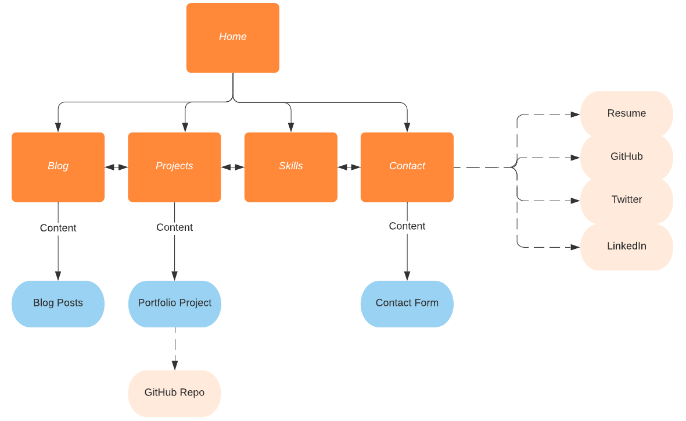
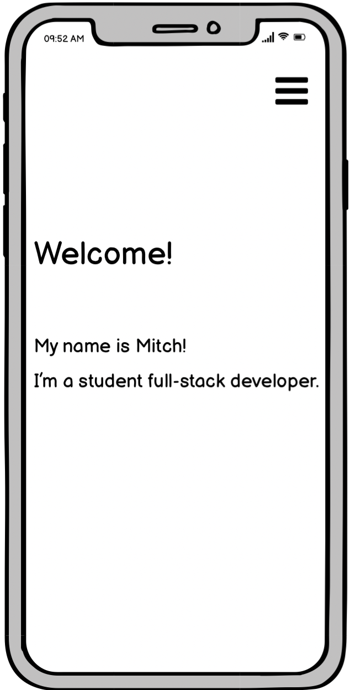
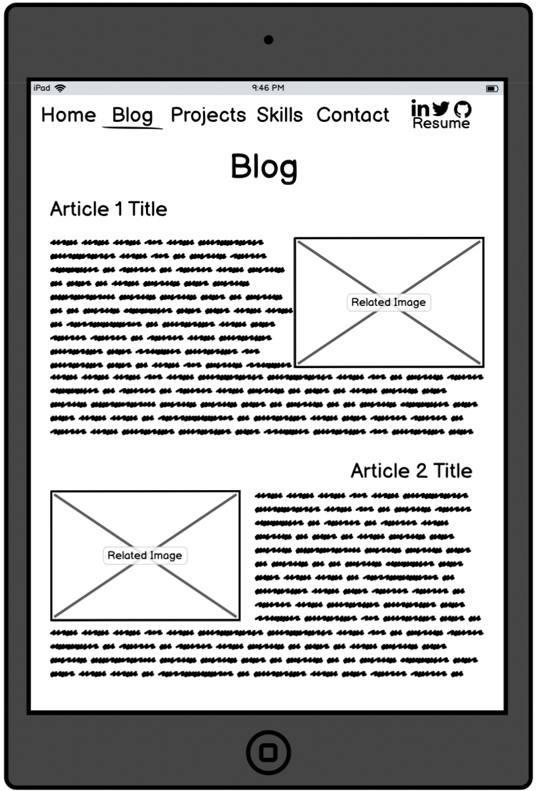
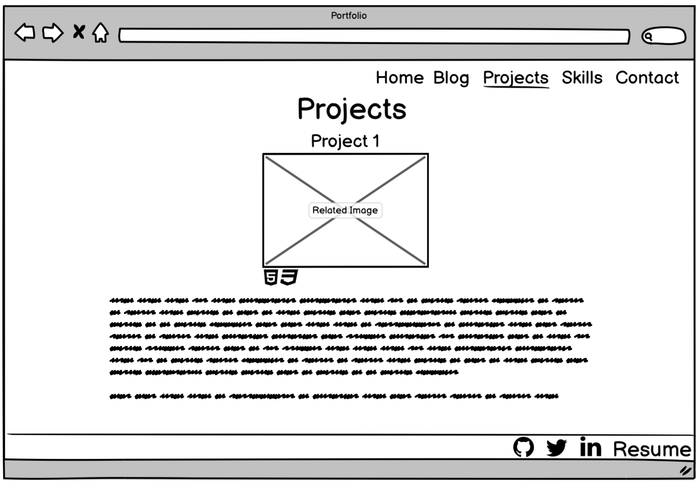
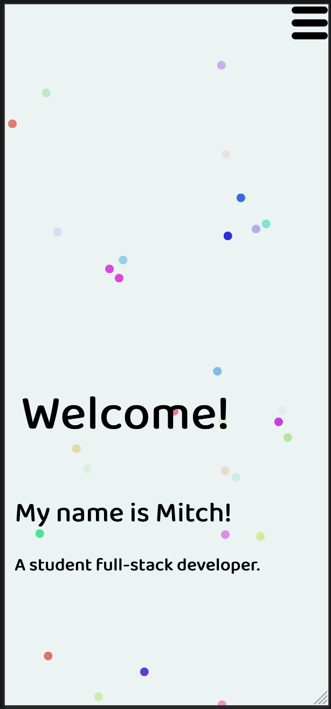
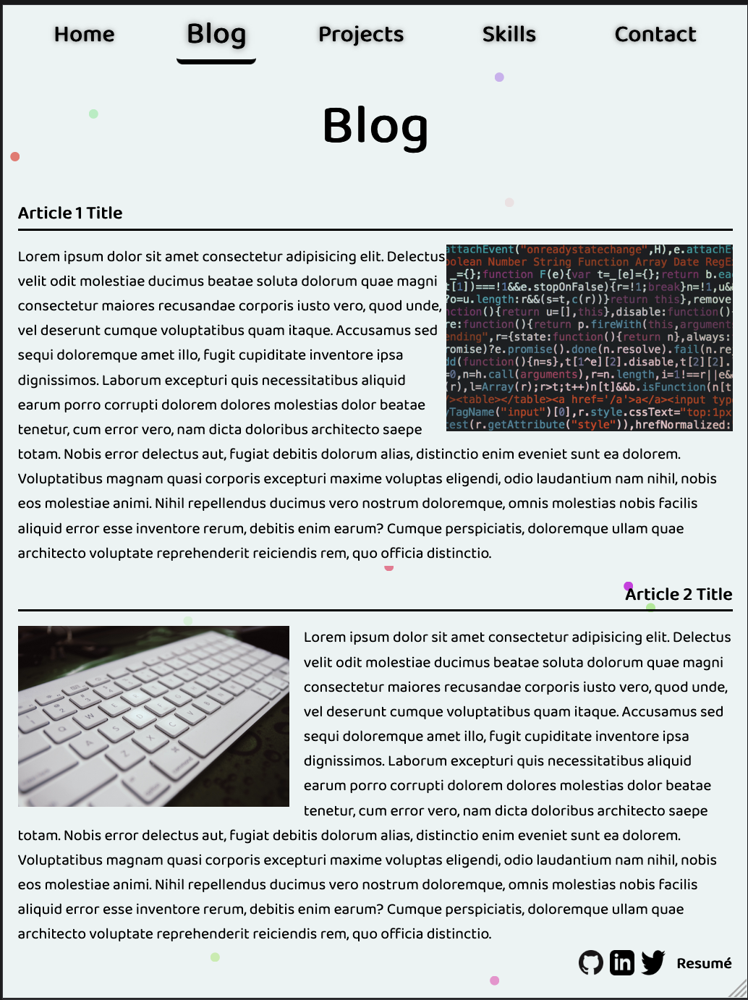
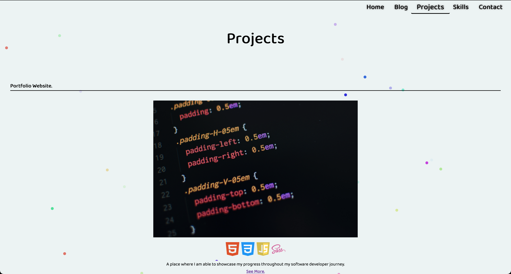

# Term 1 Assignment 2 - Portfolio
 
## Purpose
 
This is my portfolio, built and designed to demonstrate my understanding and ever growing skill set of web development.
 
[View the site](mitchdev.netlify.app/)
 
[View the repository](https://github.com/BroadwayAus/Portfolio)

# Table Of Content
- [Functionality & Features](#Functions)
- [Sitemap](#sitemap)
- [Screenshots](#screenshots)
    - [Wireframe](#wireframe)
    - [Live site](#live-site)
- [Target Audience](#target-audience)
- [Tech Stack](#tech-stack)
 
 
# Functionality & Features  
 
My Portfolio is a responsive multiple page website consisting of a:
 
* Landing page
* Blog page
* Projects page
* Skills page
* Contact page
 
These pages are made of many components, such as:
 
* Navigation bars & Menus
* Sticky Footer
* Social media links
* Resume download
* Animations
* Articles
 
# Sitemap

 
# Screenshots
 
### Wireframe
 

 
### Live site
 

 
# Target Audience
 
This project's target audience includes but is not limited to colleagues, potential employers & peers.
 
# Tech Stack
 
The tech used to develop and maintain this project include:
 
* HTML5
* CSS3/SASS
* JavaScript
* Netlify
* Formspree API
* Git