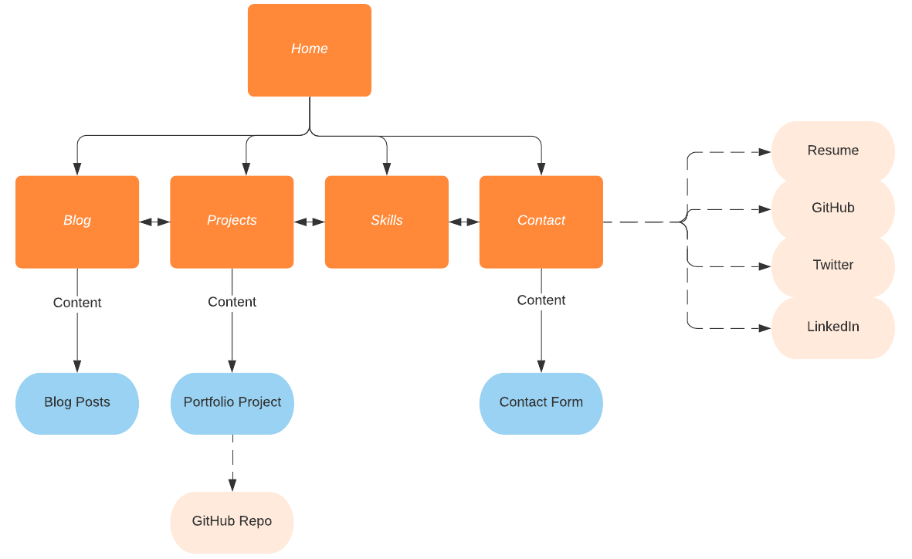
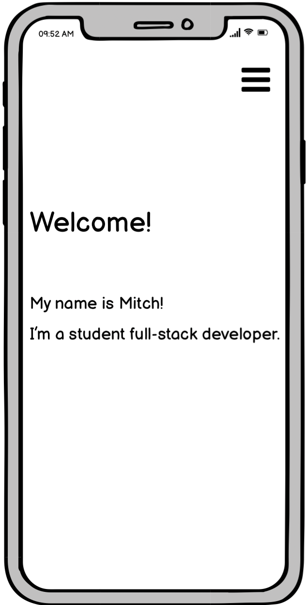
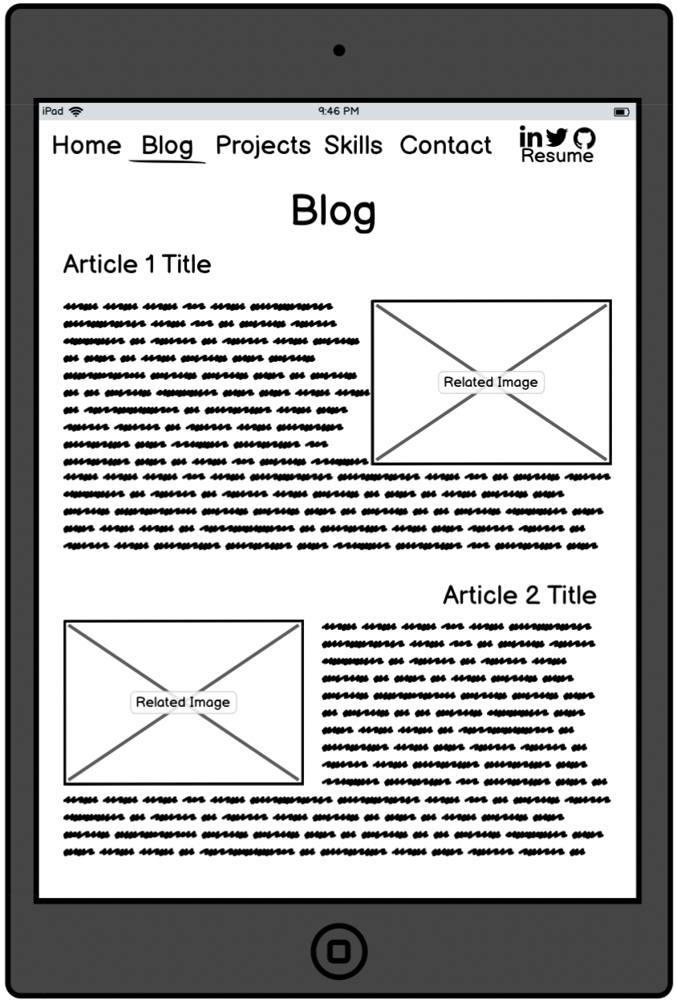
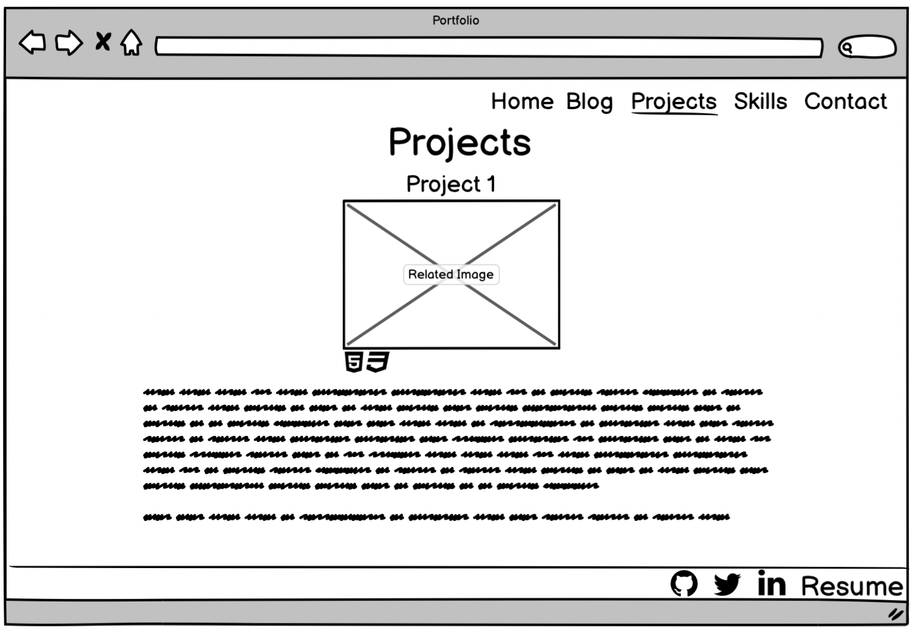
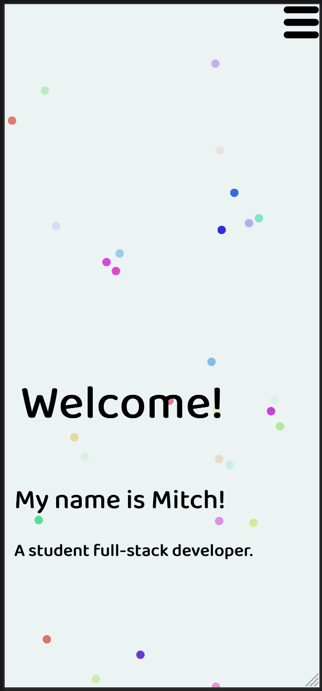
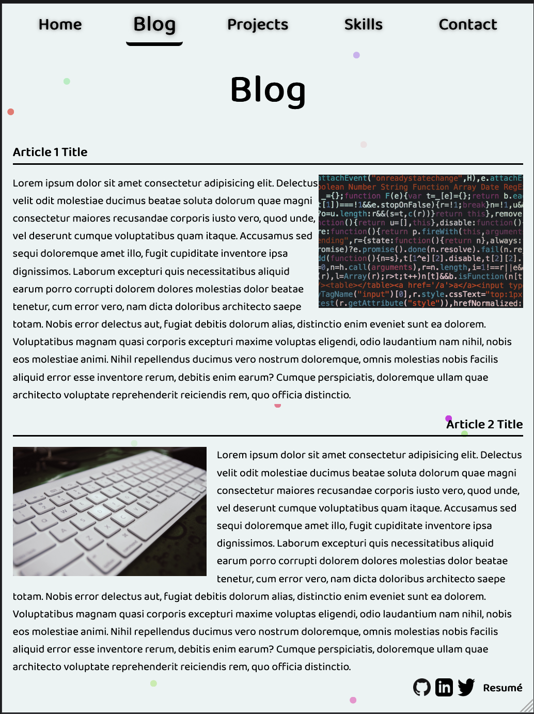
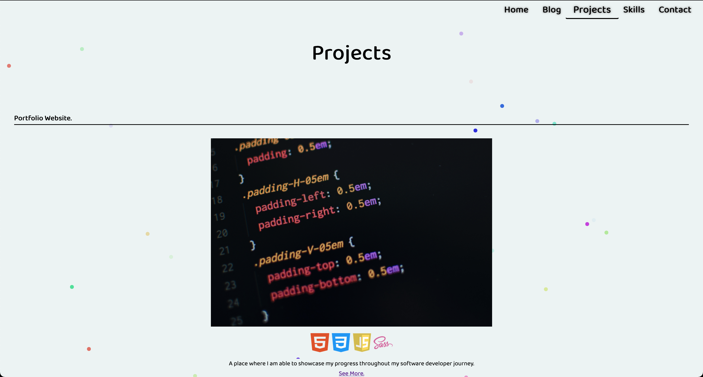

# Term 1 Assignment 2 - Portfolio

## Purpose

This is my portfolio, built and design to demonstrate my understanding and ever growing skill set of web development.

[View the site](mitchdev.netlify.app/)

[View the repository](https://github.com/BroadwayAus/Portfolio)

# Read Me Content

* [Functionality & Features](#Functionality)
* [Sitemap](#Sitemap)
* [Screenshots](#Screenshots)
* [Target Audience](#Audience)
* [Tech Stack](#Stack)

 # Functionality & Features

My Portfolio is a responsive multiple page website consisting of a:

* Landing page
* Blog page
* Projects page
* Skills page
* Contact page

These pages are made of many components, such as:

* Navigation bars & Menus
* Sticky Footer
* Social media links
* Resume download
* Animations
* Articles

# Sitemap

# Screenshots

### Wireframes

### Live site

# Target Audience

This projects target audience includes but is not limited to collegues, potential employers & peers.

# Tech Stack

The tech used to develop and maintain this project include:

* HTML5
* CSS/SASS
* JavaScript
* Netlify
* Formspree API
* Git